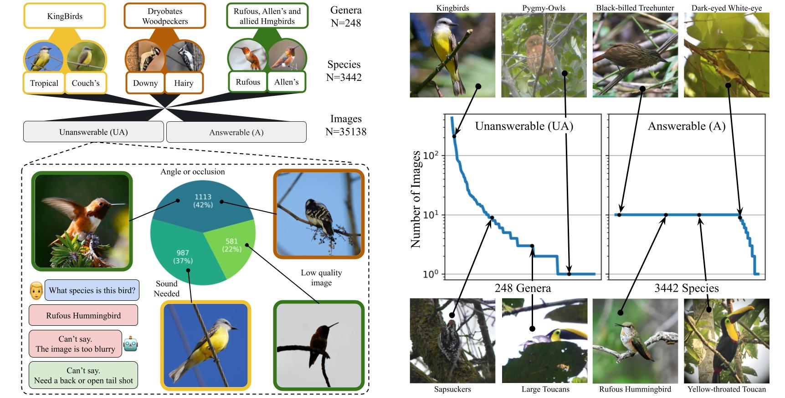

# RealBirdID <a href="https://arxiv.org/abs/2603.27033">[arXiv]</a> <a href="https://huggingface.co/datasets/cvl-umass/RealBirdID">[HuggingFace]</a> 

This is the supporting code for the visual abstention benchmark, RealBirdID (hosted in <a href="https://arxiv.org/abs/2401.02460">[HuggingFace]</a>). It was proposed in:

### RealBirdID: Benchmarking Bird Species Identification in the Era of MLLMs

[Logan Lawrence](https://www.loganlawrence.info/), [Mustafa Chasmai](https://mustafa1728.github.io/), [Rangel Daroya](https://rangeldaroya.github.io/), [Wuao Liu](https://wuao652.github.io/), [Seoyun Jeong](https://www.linkedin.com/in/seoyun-yuni-jeong/), [Aaron Sun](https://aaronsun1030.github.io/), [Max Hamilton](https://johnmaxh.github.io/), [Fabien Delattre](https://fabiendelattre.com/), [Oindrila Saha](http://oindrilasaha.github.io), [Subhransu Maji](http://people.cs.umass.edu/~smaji/), [Grant Van Horn](https://gvh.codes)

[Computer Vision Lab @ UMass](https://www.cics.umass.edu/organizations/computer-vision-research-lab)

CVPR'26 



## Citation
If you find our work useful, please consider citing:

```
@inproceedings{lawrence2026realbirdid,
  title={Improved Zero-Shot Classification by Adapting VLMs with Text Descriptions},
  author={Lawrence, Logan and Chasmai, Mustafa and Daroya, Rangel and Liu, Wuao and Jeong, Seoyun and Sun, Aaron and Hamilton, Max and Delattre, Fabien and Saha, Oindrila and Maji, Subhransu and others},
  booktitle={Proceedings of the IEEE/CVF Conference on Computer Vision and Pattern Recognition},
  year={2026}
}
```
